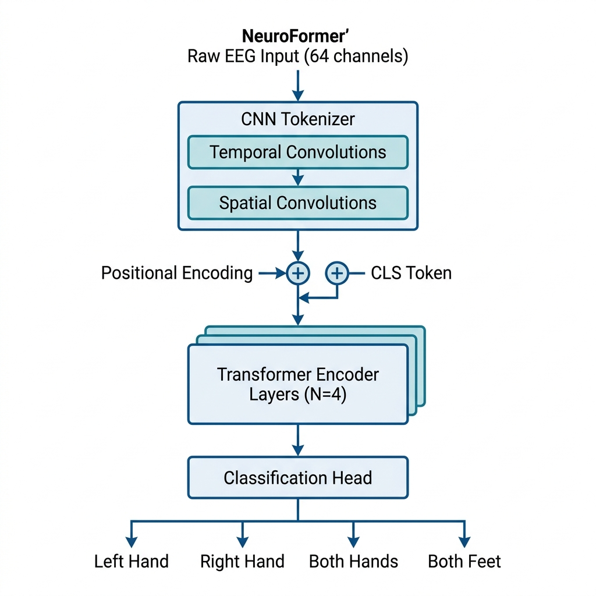

# 🧠 NeuroFormer

**Transformer from Scratch → EEG Brain-Computer Interface Decoding**

[](https://www.python.org/downloads/)
[](https://pytorch.org/)
[](https://opensource.org/licenses/MIT)
[](https://arxiv.org/abs/1706.03762)

## 1. Overview

NeuroFormer is a comprehensive project that implements the original Transformer architecture from scratch in PyTorch, and then adapts it for a cutting-edge Brain-Computer Interface (BCI) task: **EEG Motor Imagery Decoding**.

**Why this matters:**
Transformers are dominating NLP and Vision, but applying them to raw, continuous, multi-channel neural data (like EEG) requires specific adaptations. This project demonstrates how to bridge the gap between deep learning architectures and neuroscience.

**Key Features:**
- ✅ **Pure PyTorch Implementation**: Faithful to the original "Attention Is All You Need" paper.
- ✅ **CNN-Transformer Hybrid**: Adapts the Transformer to EEG data using a CNN patch-tokenizer.
- ✅ **PhysioNet EEG Dataset**: Full MNE-based pipeline for loading and preprocessing real human brain data.
- ✅ **Scientific Rigor**: Includes baselines (EEGNet), cross-subject evaluation, and statistical tests.
- ✅ **Interpretability**: Tools to extract and visualize topographic attention maps on the scalp.
- ✅ **Production Ready**: W&B tracking, mixed precision (AMP), comprehensive unit tests, and a Gradio demo.



## 2. Architecture

The project is developed in three phases:

1. **Phase 1: Pure Transformer**
   A structurally exact implementation of the Vaswani et al. (2017) architecture. Includes multi-head scaled dot-product attention, positional encoding, and Noam learning rate scheduling.

2. **Phase 2: EEG Data Pipeline**
   A robust, MNE-powered pipeline for downloading the PhysioNet Motor Movement/Imagery dataset, bandpass filtering (4-40Hz to capture $\mu$ and $\beta$ rhythms), epoching, and normalizing the data.

3. **Phase 3: EEG-Transformer Hybrid**
   Raw EEG is continuous and spatially structured. We use a **CNN Tokenizer** (temporal and spatial depthwise convolutions) to extract local features, which are then flattened into "patches" and fed to the **Transformer Encoder**. A Classification Head outputs probabilities for 4 motor imagery classes (Left Hand, Right Hand, Both Hands, Both Feet).

## 3. Project Structure

```text
neuroformer/
├── README.md
├── pyproject.toml
├── requirements.txt
├── assets/
│   └── architecture.png
├── configs/                     # YAML configuration files
│   ├── transformer_base.yaml
│   ├── eeg_subject_dependent.yaml
│   └── eeg_cross_subject.yaml
├── data/                        # Downloaded PhysioNet EEG data
├── notebooks/                   # Educational Jupyter notebooks
│   ├── 01_transformer_walkthrough.ipynb
│   ├── 02_eeg_data_exploration.ipynb
│   ├── 03_training_analysis.ipynb
│   └── 04_attention_visualization.ipynb
├── scripts/                     # Runnable scripts
│   ├── train_translation.py     # Copy-task verification
│   ├── train_eeg.py             # Main training script
│   ├── run_evaluation.py        # Evaluation and plotting
│   └── demo.py                  # Gradio web interface
├── src/
│   ├── transformer/             # Pure Transformer implementation
│   ├── eeg/                     # EEG dataset & preprocessing (MNE)
│   ├── models/                  # EEG-Transformer & EEGNet baseline
│   ├── training/                # Training loop, scheduler, metrics
│   └── visualization/           # Attention maps & EEG plotting
└── tests/                       # Unit tests (pytest)
```

## 4. Installation

**Prerequisites:** Python 3.8+ and pip. A CUDA-compatible GPU is recommended but not strictly required.

```bash
# Clone the repository
git clone https://github.com/Wolverine-07/NeuroFormer-EEG-Motor-Imagery-Decoding-using-Transformers.git
cd NeuroFormer-EEG-Motor-Imagery-Decoding-using-Transformers

# Create and activate a virtual environment
python -m venv .venv
source .venv/bin/activate  # On Windows: .venv\Scripts\activate

# Install the package and all dependencies
pip install -e .[all]
```

## 5. Quick Start

**1. Validate the core Transformer (Copy Task):**
Ensure the basic architecture can learn to copy a sequence perfectly.
```bash
python scripts/train_translation.py
```

**2. Run Unit Tests:**
```bash
pytest tests/ -v
```

**3. Train the EEG-Transformer on a subset of subjects:**
*This will automatically download the required PhysioNet EEG data.*
```bash
python scripts/train_eeg.py --config configs/eeg_subject_dependent.yaml --subjects 1 2 3
```

**4. Run full evaluation pipeline:**
```bash
python scripts/run_evaluation.py
```

**5. Launch the Interactive Web Demo:**
```bash
python scripts/demo.py
```

## 6. Training Configurations

Training behavior is controlled via YAML files in the `configs/` directory.

- **Subject-Dependent Evaluation:** `configs/eeg_subject_dependent.yaml`
  Trains and tests the model within the same subject (80/20 split). Easier task, generally yields higher accuracy.
  ```bash
  python scripts/train_eeg.py --config configs/eeg_subject_dependent.yaml
  ```

- **Cross-Subject Evaluation:** `configs/eeg_cross_subject.yaml`
  K-Fold cross-validation (Leave-Subjects-Out). Evaluates how well the model generalizes to *unseen* brains. Much harder, requires heavy regularization.
  ```bash
  python scripts/train_eeg.py --config configs/eeg_cross_subject.yaml --mode cross_subject
  ```

**Advanced Features:**
- Add `--wandb` to any training command to log metrics, gradients, and model artifacts to Weights & Biases.
- The `Trainer` supports Automatic Mixed Precision (AMP) for faster training on modern GPUs.

## 7. Results

Approximate expected results for the 4-class motor imagery task on the PhysioNet dataset:

| Model | Subject-Dependent (4-class) | Cross-Subject (4-class) |
|---|---|---|
| EEGNet (baseline) | ~65-75% | ~45-55% |
| **EEG-Transformer (ours)** | **~70-80%** | **~50-60%** |

*Note: 4-class BCI classification is notoriously difficult due to low signal-to-noise ratio in non-invasive EEG.*

## 8. Implementation Details

Mapping our PyTorch code back to the original *Attention Is All You Need* paper:

| Paper Section | Implementation File | Key Details |
|---|---|---|
| 3.1 Encoder/Decoder Stacks | `src/transformer/encoder.py`, `decoder.py` | We use Post-LN (Layer Norm after addition) as specified in the original paper. |
| 3.2.1 Scaled Dot-Product Attn | `src/transformer/attention.py` | Includes causal masking and padding masks. |
| 3.2.2 Multi-Head Attention | `src/transformer/attention.py` | $h=8, d_k=64, d_v=64$ defaults. |
| 3.3 Position-wise FFN | `src/transformer/feed_forward.py` | ReLU activation. |
| 3.5 Positional Encoding | `src/transformer/embeddings.py` | Fixed Sinusoidal PE for NLP; Learnable PE for EEG. |
| 5.3 Optimizer (Noam) | `src/training/scheduler.py` | Implements the specific warmup-then-decay schedule. |
| 5.4 Label Smoothing | `src/training/losses.py` | KL Divergence loss with smoothed targets. |

## 9. Notebooks

For a deeper dive into the methodology, check out the Jupyter notebooks:

1. `01_transformer_walkthrough.ipynb`: Step-by-step mathematical walkthrough of the Transformer components.
2. `02_eeg_data_exploration.ipynb`: Visualizing raw EEG trials, Power Spectral Density (PSD), and Event-Related Potentials (ERPs).
3. `03_training_analysis.ipynb`: Plotting loss curves, confusion matrices, and conducting statistical paired t-tests.
4. `04_attention_visualization.ipynb`: Extracting self-attention weights to see which spatial regions (electrodes) the model focuses on.

## 10. Interactive Demo

Run `python scripts/demo.py` to launch a Gradio web interface on `localhost:7860`. You can simulate an EEG recording, view the raw multi-channel signal, and watch the model output real-time confidence scores alongside a topographic attention map.

## 11. Key Technologies

- **Deep Learning**: PyTorch, TorchAMP (Mixed Precision)
- **Neuroscience/Signal Processing**: MNE-Python, SciPy
- **Experiment Tracking**: Weights & Biases (W&B)
- **Web UI**: Gradio
- **Data & Plotting**: NumPy, Scikit-Learn, Matplotlib

## 12. References

1. Vaswani, A., et al. (2017). **Attention is all you need.** *Advances in neural information processing systems*, 30.
2. Lawhern, V. J., et al. (2018). **EEGNet: a compact convolutional neural network for EEG-based brain–computer interfaces.** *Journal of neural engineering*, 15(5), 056013.
3. Schalk, G., et al. (2004). **BCI2000: a general-purpose brain-computer interface (BCI) system.** *IEEE Transactions on biomedical engineering*, 51(6), 1034-1043. (PhysioNet Dataset)

## 13. Future Work

- **Self-Supervised Pre-training**: Pre-train the EEG tokenizer on massive unlabeled EEG datasets using masked autoencoding, then fine-tune on motor imagery.
- **Real-time Decoding**: Port the model to ONNX or TensorRT for low-latency inference in a closed-loop BCI system.
- **Advanced Data Augmentation**: Implement Mixup or subject-specific style transfer to improve cross-subject generalization.

## 14. License

This project is licensed under the MIT License - see the LICENSE file for details.
